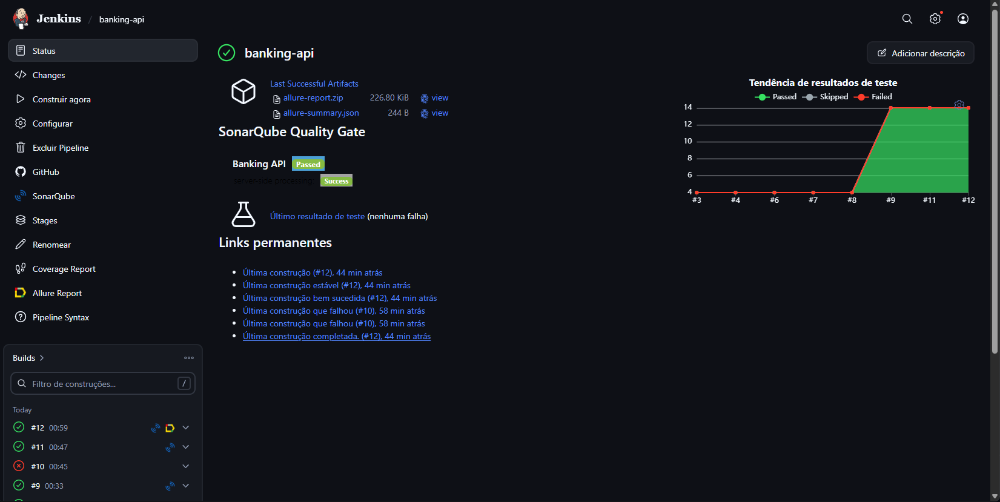
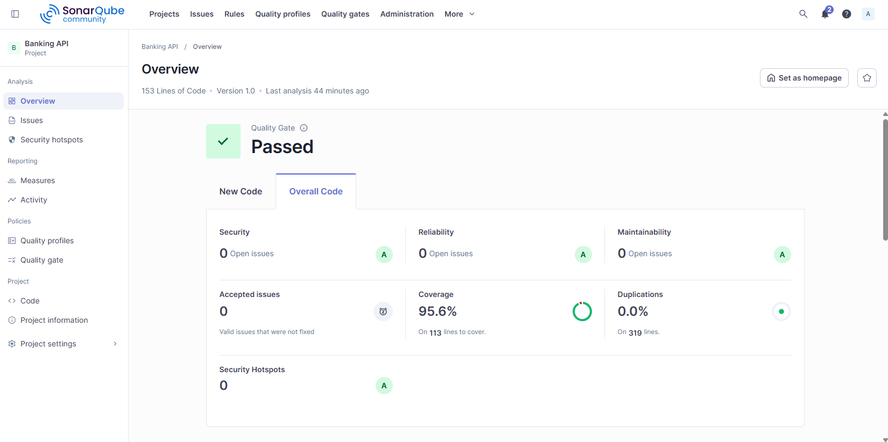
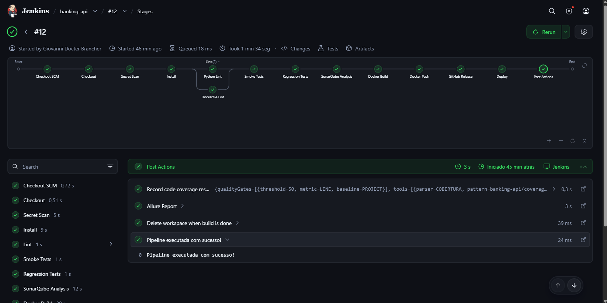
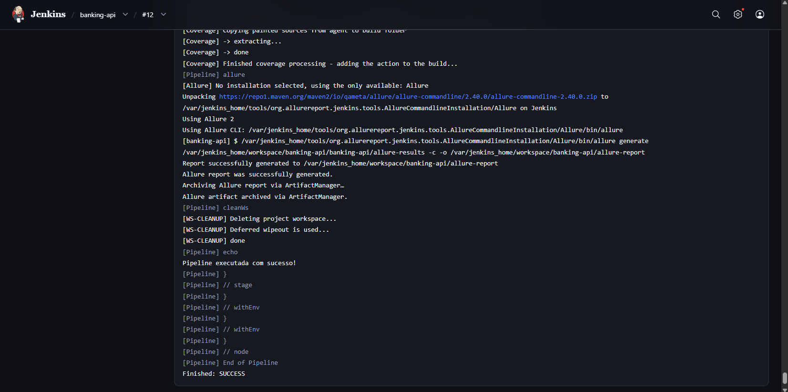
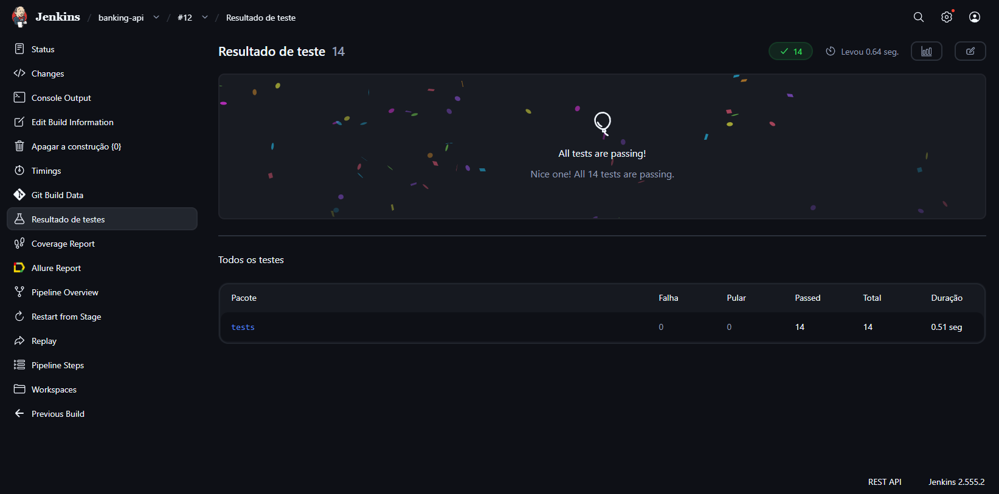
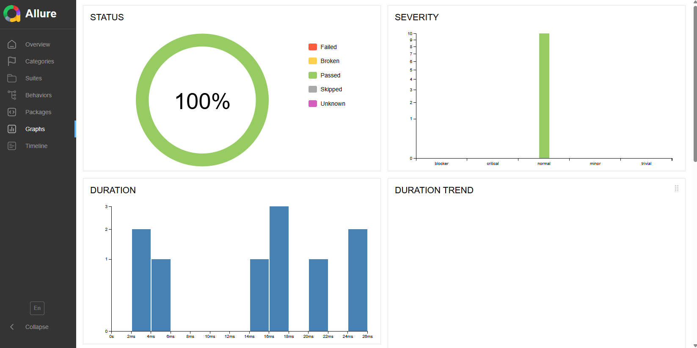
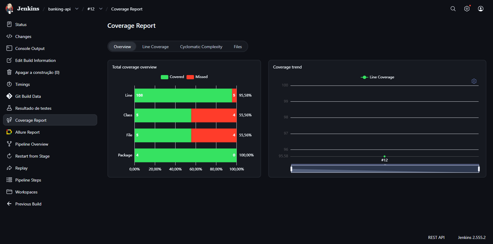
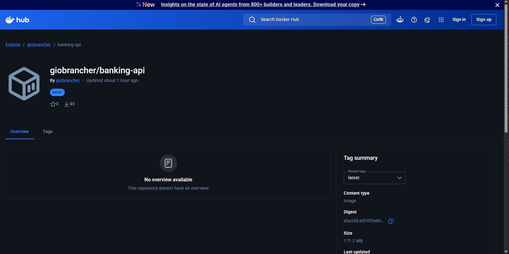
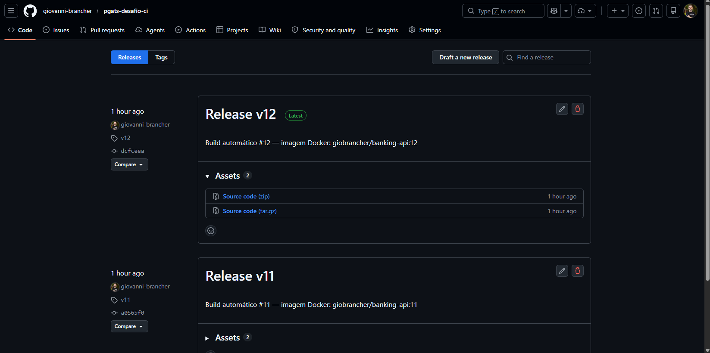
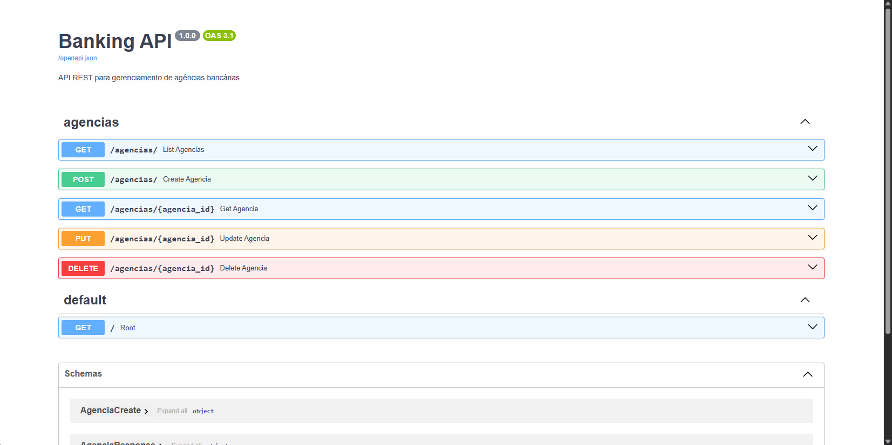

# PGATS — Desafio 04: Integração Contínua com Jenkins

---

## Índice

- [Exercícios](#exercícios)
  - [Exercício 1 — Implementação de Pipeline em Ferramenta de CI](#exercício-1--implementação-de-pipeline-em-ferramenta-de-ci)
  - [Exercício 2 — Plugins e Actions do Marketplace](#exercício-2--plugins-e-actions-do-marketplace)
  - [Exercício 3 — Self-hosted Runners/Agents](#exercício-3--self-hosted-runnersagents)
- [Como Rodar](#como-rodar)
  - [Pré-requisitos](#pré-requisitos)
  - [1. Subir a infraestrutura de CI](#1-subir-a-infraestrutura-de-ci)
  - [2. Configurar o Jenkins](#2-configurar-o-jenkins)
  - [3. Criar o job](#3-criar-o-job)
  - [4. Rodar a API localmente](#4-rodar-a-api-localmente-opcional)
- [Evidências de Execução](#evidências-de-execução)
  - [Infraestrutura](#infraestrutura)
  - [Pipeline](#pipeline)
  - [Testes](#testes)
  - [SonarQube](#sonarqube)
  - [Docker Hub](#docker-hub)
  - [GitHub Release](#github-release)
  - [API em Execução](#api-em-execução)
  - [Credenciais Configuradas no Jenkins](#credenciais-configuradas-no-jenkins)
  - [Arquivos Principais](#arquivos-principais)

---

## Exercícios

### Exercício 1 — Implementação de Pipeline em Ferramenta de CI

**Ferramenta escolhida: Jenkins**

Foi implementada uma pipeline declarativa completa no Jenkins para uma API REST bancária desenvolvida em Python com FastAPI. A pipeline está versionada no arquivo `banking-api/Jenkinsfile` e contempla os seguintes estágios:

| Stage | Descrição |
|---|---|
| Checkout | Clona o repositório via `checkout scm` |
| Secret Scan | TruffleHog varre o código em busca de credenciais e tokens vazados |
| Install | Cria virtualenv Python e instala as dependências do projeto |
| Lint (paralelo) | flake8 para o código Python e hadolint para o Dockerfile, executados em paralelo |
| Smoke Tests | Testes de sanidade com pytest, gerando relatório JUnit XML e resultados Allure |
| Regression Tests | Testes completos de regressão, executados condicionalmente na branch master ou via agendamento (cron) |
| SonarQube Analysis | Análise estática de qualidade e cobertura de código |
| Docker Build | Build da imagem com tags `BUILD_NUMBER` e `latest` |
| Docker Push | Envio da imagem para o Docker Hub com credenciais seguras |
| GitHub Release | Criação automática de release via API do GitHub, condicionada à branch master |
| Deploy | Subida da aplicação com `docker compose up -d` |

A infraestrutura foi containerizada com um `docker-compose.yml` dedicado para Jenkins e SonarQube, e um `Dockerfile.jenkins` customizado instalando Python 3, pip, venv e Docker CLI sobre a imagem oficial do Jenkins LTS.

---

### Exercício 2 — Plugins e Actions do Marketplace

Foram incorporadas três ferramentas ao pipeline, todas com equivalentes no GitHub Marketplace (https://github.com/marketplace?type=actions):

#### TruffleHog — Secret Scanning

Detecta automaticamente credenciais, tokens de API e chaves privadas vazadas no código-fonte antes de qualquer etapa de build. A implementação executa o scanner via container Docker (`trufflesecurity/trufflehog:latest`) com as flags `--only-verified` e `--fail`, garantindo que apenas segredos confirmados interrompem o pipeline — evitando falsos positivos. Implementado no stage `Secret Scan` do Jenkinsfile.

#### hadolint — Dockerfile Linting

Analisa o Dockerfile contra boas práticas de segurança e eficiência (versões não fixadas em apt-get, camadas desnecessárias, instruções inseguras). Foi configurado com `--failure-threshold error`, de modo que apenas erros críticos quebram o build; avisos são registrados de forma informativa. Executa em paralelo com o lint do Python, reduzindo o tempo total do pipeline.

#### Allure Report + Coverage Report — Relatórios Visuais

O Allure Report gera um relatório interativo com histórico de tendência, duração por teste, categorização de falhas e rastreabilidade. O Coverage Report, integrado ao plugin Coverage do Jenkins, publica a porcentagem de cobertura de linhas diretamente na página do build com quality gate configurado (mínimo 50%). A implementação adicionou `allure-pytest` ao `requirements.txt`, o argumento `--alluredir=allure-results` aos comandos pytest, e os publishers `allure(...)` e `recordCoverage(...)` no bloco `post always` da pipeline, antes da limpeza do workspace.

---

### Exercício 3 — Self-hosted Runners/Agents

#### Quando faz sentido usar?

Self-hosted agents são a escolha adequada quando:

- O pipeline precisa de acesso a recursos de rede interna (bancos de dados, APIs privadas, VPNs) inacessíveis a runners gerenciados
- O build depende de hardware específico, como GPU para machine learning ou volumes maiores de RAM e armazenamento
- Requisitos de compliance ou segurança proíbem que código ou dados trafeguem por infraestrutura de terceiros
- O volume de builds é alto o suficiente para tornar o custo por minuto de runners gerenciados economicamente inviável
- O ambiente de execução precisa de software licenciado instalado localmente

#### Outras plataformas oferecem recursos similares?

Sim. O conceito está presente em todas as principais plataformas de CI/CD, embora com nomenclaturas diferentes:

| Plataforma | Termo | Forma de registro |
|---|---|---|
| GitHub Actions | Self-hosted Runner | Script `config.sh` + token gerado no repositório |
| GitLab CI | GitLab Runner | `gitlab-runner register` via CLI |
| Azure DevOps | Self-hosted Agent | Agent pools configurados via portal |
| CircleCI | Self-hosted Runner | Namespace + token via CLI |
| Bitbucket Pipelines | Runners | Container Docker com agente registrado |

#### Implementação — Self-hosted Agent no Jenkins

O self-hosted agent foi implementado neste projeto e pode ser verificado neste repositório. O Jenkins não utiliza infraestrutura gerenciada — ele executa em um container Docker na máquina local, constituindo um agente self-hosted completo.

O principal desafio técnico foi conceder ao container Jenkins acesso ao Docker socket do host (`/var/run/docker.sock`) para que o pipeline pudesse executar builds e deploys de containers. Isso foi resolvido em três camadas:

**`Dockerfile.jenkins`** — imagem customizada que instala sobre o Jenkins LTS: Python 3, pip, venv, Docker CE CLI e o plugin Docker Compose, além de copiar o script de inicialização customizado.

**`jenkins-entrypoint.sh`** — script que resolve o problema de permissão do socket de forma dinâmica: detecta o GID atual do socket no host (que pode variar conforme o ambiente), localiza o grupo correspondente e adiciona o usuário `jenkins` a esse grupo antes de iniciar o processo principal. Essa abordagem é mais robusta que fixar GIDs em tempo de build da imagem.

**`docker-compose.yml`** — monta o socket do host no container e define a variável `DOCKER_HOST`, permitindo que o agente execute comandos Docker sem necessitar de um daemon Docker separado dentro do container (padrão Docker-out-of-Docker via socket passthrough).

Essa arquitetura é amplamente adotada em ambientes self-hosted de CI por equilibrar praticidade operacional com isolamento de segurança razoável.

---

## Como Rodar

### Pré-requisitos

- Docker Desktop rodando
- Git
- Porta `9090` (Jenkins), `9000` (SonarQube) e `3308` (MySQL) livres

### 1. Subir a infraestrutura de CI

```bash
git clone https://github.com/giovanni-brancher/pgats-desafio-ci.git
cd pgats-desafio-ci

docker compose up -d
```

Aguarde ~1 minuto. Acesse:
- Jenkins: http://localhost:9090
- SonarQube: http://localhost:9000 (admin / admin)

### 2. Configurar o Jenkins

**Plugins necessários** (Manage Jenkins → Plugins → Available):
- `Allure Jenkins Plugin`
- `Coverage`

**Ferramenta Allure** (Manage Jenkins → Tools → Allure Commandline):
- Name: `Allure` → Install automatically

**Credenciais** (Manage Jenkins → Credentials → Global → Add):

| ID | Tipo | Valor |
|---|---|---|
| `dockerhub-credentials` | Username + Password | Login do Docker Hub |
| `sonarqube-token` | Secret text | Token gerado no SonarQube |
| `banking-api-env` | Secret file | Arquivo `.env` com as variáveis da API |
| `github-token` | Secret text | GitHub Personal Access Token (scope: `repo`) |

**SonarQube** (Manage Jenkins → System → SonarQube servers):
- Name: `SonarQube` | URL: `http://sonarqube:9000`

**SonarScanner** (Manage Jenkins → Tools → SonarQube Scanner):
- Name: `SonarScanner` → Install automatically

### 3. Criar o job

1. New Item → **Pipeline** → Nome: `banking-api`
2. Pipeline → Definition: `Pipeline script from SCM`
3. SCM: Git | URL: `https://github.com/giovanni-brancher/pgats-desafio-ci.git`
4. Branch: `*/master`
5. Script Path: `banking-api/Jenkinsfile`
6. Desmarcar "Lightweight checkout"
7. Save → **Build Now**

### 4. Rodar a API localmente (opcional)

```bash
cd banking-api
cp .env.example .env   # ajuste as variáveis
docker compose up -d
```

API disponível em: http://localhost:8000
Docs: http://localhost:8000/docs

---

## Evidências de Execução

### Infraestrutura

| Componente | URL | Status |
|---|---|---|
| Jenkins | http://localhost:9090 | Rodando via Docker |
| SonarQube | http://localhost:9000 | Rodando via Docker |
| Docker Hub | https://hub.docker.com/r/giobrancher/banking-api | Imagem publicada |

#### Jenkins em execução
<!-- docs/screenshots/jenkins-running.png -->


#### SonarQube em execução
<!-- docs/screenshots/sonarqube-running.png -->


### Pipeline

Todos os 11 stages executados com sucesso na branch `master`:

| Stage | Resultado |
|---|---|
| Secret Scan | TruffleHog — nenhum segredo verificado encontrado |
| Install | 38 pacotes instalados, incluindo `allure-pytest` |
| Lint (paralelo) | flake8 sem erros; hadolint sem erros críticos |
| Smoke Tests | 4 testes passando — relatório JUnit e Allure publicados |
| Regression Tests | 10 testes passando (smoke + regression) |
| SonarQube Analysis | Análise enviada ao servidor local (porta 9000) |
| Docker Build/Push | Imagem `giobrancher/banking-api` publicada no Docker Hub |
| GitHub Release | Release `v{BUILD_NUMBER}` criada automaticamente via API |
| Deploy | `docker compose up -d` com `.env` injetado via Secret file |

#### Visão geral dos stages
<!-- docs/screenshots/pipeline-stages.png -->


#### Console Output — build com sucesso
<!-- docs/screenshots/pipeline-success.png -->


### Testes

#### Resultados JUnit no Jenkins
<!-- docs/screenshots/junit-results.png -->


#### Allure Report
<!-- docs/screenshots/allure-report.png -->


#### Coverage Report
<!-- docs/screenshots/coverage-report.png -->


### SonarQube

#### Análise de qualidade
<!-- docs/screenshots/sonarqube-analysis.png -->


### Docker Hub

#### Imagem publicada
<!-- docs/screenshots/dockerhub-image.png -->


### GitHub Release

#### Release criada automaticamente
<!-- docs/screenshots/github-release.png -->


### API em Execução

#### Swagger UI — http://localhost:8000/docs
<!-- docs/screenshots/api-swagger.png -->


#### Endpoint GET /agencias
<!-- docs/screenshots/api-get-agencias.png -->


### Credenciais Configuradas no Jenkins

| ID | Tipo | Uso |
|---|---|---|
| `dockerhub-credentials` | Username + Password | Docker Hub push |
| `sonarqube-token` | Secret text | SonarQube analysis |
| `banking-api-env` | Secret file | `.env` no deploy |
| `github-token` | Secret text | GitHub Release API |

### Arquivos Principais

| Arquivo | Descrição |
|---|---|
| [`docker-compose.yml`](docker-compose.yml) | Jenkins + SonarQube containerizados |
| [`Dockerfile.jenkins`](Dockerfile.jenkins) | Jenkins com Python 3, Docker CLI e venv |
| [`jenkins-entrypoint.sh`](jenkins-entrypoint.sh) | Fix dinâmico do GID do Docker socket |
| [`banking-api/Jenkinsfile`](banking-api/Jenkinsfile) | Pipeline declarativa com 11 stages |
